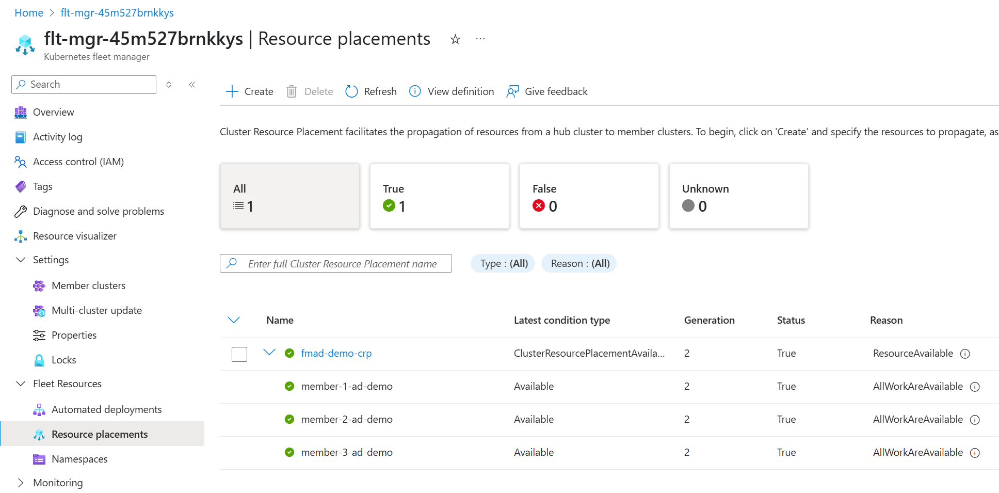

# Azure Kubernetes Fleet Manager Automated Deployments Demo

This repository contains the code and instructions to deploy a demo of the Fleet Manager Automated Deployments feature.

It contains two main components:

- A Bicep template to deploy the Azure resources required for the demo.
- A simple Python Flask web application that will be containerized and deployed to Fleet member clusters.

## Deploying Azure resources

### Prerequisites

- Check there is [sufficient vCPU quota](https://learn.microsoft.com/azure/virtual-machines/quotas?tabs=cli) in the regions you intend to use. This demo uses a single Subscription, but Fleet Manager can manage clusters in multiple subscriptions and regions as long as the subscriptions are linked to the same Entra ID tenant.

- The Bicep deployment is targeted at the Azure Subscription level so the user running the deployment must have permissions to create resource groups in addition to AKS clusters, Azure Container Registry and Azure Kubernetes Fleet Manager resources.

- The deployment creates an Entra ID role assignment, so the user running the deployment must have sufficient permissions to assign roles.

- Azure Kubernetes Fleet Manager requires your user to hold the `Azure Kubernetes Fleet Manager RBAC Cluster Admin` role in order to interact with the Fleet Manager hub cluster.

Deployment takes ~ 30 minutes depending on the number of clusters you are deploying. If you hit an error your can fix it and then re-run the deployment command. The Bicep deployment will only create resources that do not already exist.

### Azure resource steps

1. Modify the `infra/main.bicepparam` file, setting details on VM sizes, number of member clusters (recommendation is minimum of 2), and the Azure region where the resources will be deployed. You can use non-production VM sizes for this demo.

1. Run the following command to deploy the Azure resources:

   ```bash
   az deployment sub create \
    --name fleetmgr-$(date -I) \
    --location <fleet-location> \
    --subscription <demo-sub-id> \
    --template-file main.bicep \
    --parameters main.bicepparam
   ```

Troubleshooting:

1. If during deployment you receive ERROR CODE: VMSizeNotSupported - select a different VM size and update `vmsize` in the `infra/main.bicepparam` file. This is applied to all clusters including the Fleet Manager hub cluster.
1. If you re-run the deployment you may receive an error due to attempting to re-create the role assignment for the AKS clusters to use AcrPull on the Container Registry. These can safely be ignored. Once deployed you can validate access to the Container Registry and AKS clusters using the Azure CLI command `az aks check-acr` ([see docs](https://learn.microsoft.com/cli/azure/aks?view=azure-cli-latest#az-aks-check-acr)). Note there may be a delay before the role assignment is applied.

## Outputs

The result of the Bicep deployment is:

- An Azure Kubernetes Fleet Manager with hub cluster.
- An Azure Container Registry.
- Three AKS clusters joined as members (if you don't modify the number of clusters). Each cluster is assigned a Fleet Manager Update Group and is granted with `AcrPull` access to the Container Registry.
- A Fleet Manager [Update Strategy](https://learn.microsoft.com/azure/kubernetes-fleet/update-create-update-strategy?tabs=azure-portal) and [Auto-upgrade profile](https://learn.microsoft.com/azure/kubernetes-fleet/concepts-update-orchestration#understanding-auto-upgrade-profiles) for the member clusters which ensures they will be updated when new Kubernetes versions are available.

## Prepare Fleet Manager hub cluster

Using the Azure CLI and `kubectl` we add a new namespace to the Fleet Manager hub cluster which will be used to stage our demo application resources.

### Fleet Manager steps

1. Connect to the Fleet Manager hub cluster:

   ```bash
   az fleet get-credentials \
    --name <fleet-name> \
    --resource-group <fleet-rg>
   ```

1. Once the credentials are downloaded, you can use `kubectl` to connect to the hub cluster.

   ```bash
   kubectl create namespace fmad-demo
   ```

Troubleshooting:

1. If you receive a Forbidden error when attempting to create the namespace, check you have the `Azure Kubernetes Fleet Manager RBAC Cluster Admin` Entra ID role assigned to your user. If you add the assignment you may need to wait a few minutes for the role assignment to propagate before you can create the namespace.

## Use Fleet Manager Automated Deployments to stage application on Fleet Manager hub cluster

Next we will use Fleet to build and stage the demo application on the Fleet Manager hub cluster. For this demo you can following the official [Microsoft Learn documentation](https://learn.microsoft.com/azure/kubernetes-fleet/howto-automated-deployments), electing to containerize the application and to generate Kubernetes manifests.

Once the application is staged on the Fleet Manager hub cluster you can confirm that the assets have been created.

- A GitHub Actions workflow is created in the `/.github/workflows` directory.
- A `Dockerfile` and `.dockerignore` file are created in the `./src` directory.
- Kubernetes manifests are created in the `./src/manifests` directory.

On the Fleet Manager hub cluster you can see the following resources created in the `fmad-demo` namespace:

- A Deployment for the demo application (`kubectl get deployments -n fmad-demo`). The ready status is expected as the application is not (and cannot be) scheduled on the hub cluster.

```output
NAME           READY   UP-TO-DATE   AVAILABLE   AGE
fm-ad-app-01   0/1     0            0           5m15s
```

- A LoadBalancer Service (`kubectl get svc -n fmad-demo`). The lack of an external IP is expected as the application is not (and cannot be) scheduled on the hub cluster.

```output
NAME           TYPE           CLUSTER-IP     EXTERNAL-IP   PORT(S)          AGE
fm-ad-app-01   LoadBalancer   10.0.131.149   <pending>     8000:32289/TCP   6m28s
```

- A ConfigMap (`kubectl get cm -n fmad-demo`). For the purpose of this demo we are not using a ConfigMap, but it is created by Automated Deployments by default.

```output
NAME                  DATA   AGE
fm-ad-app-01-config   0      7m31s
kube-root-ca.crt      1      23m
```

### Place the application onto member clusters

Follow the step at the end of the [Microsoft Learn documentation](https://learn.microsoft.com/en-us/azure/kubernetes-fleet/howto-automated-deployments?tabs=use-existing-dockerfile%2Cexisting-kubernetes-manifests#define-cluster-resource-placement) to create a cluster resource placement definition to  place the application onto the member clusters. This will create a Deployment and Service on each member cluster.

In this example we place the application on all member clusters.

```yaml
apiVersion: placement.kubernetes-fleet.io/v1
kind: ClusterResourcePlacement
metadata:
  name: fmad-demo-crp
spec:
  resourceSelectors:
    - group: ""
      kind: Namespace
      name: fmad-demo
      version: v1
  policy:
    placementType: PickAll
```

You can read more about building [Cluster Resource Placement](https://learn.microsoft.com/en-us/azure/kubernetes-fleet/concepts-resource-propagation)(CRP) definitions in the documentation.

Once the CRP has been applied you can check the status via the Azure Portal via Fleet Resources > Resource Placement. It may take a few minutes for the CRP to be applied across all member clusters.



Once the member clusters have the application you can browse to their `Services and Ingresses` blade and locate the public IP address of the LoadBalancer service. You can use this to access the demo application.


## What's next?

Each time you submit a change to the source repository the GitHub Actions workflow will be triggered. This will build the Docker image, push it to the Azure Container Registry and update the Kubernetes manifests on the Fleet Manager hub cluster. The CRP will then be updated to place the new version of the application on the member clusters.

You can modify the GitHub Actions workflow to suit your needs, including filtering the steps executed depending on the change. For example if you update just the CRP you do not want to rebuild the Docker image and push it to the Container Registry. You can filter by path to achieve this outcome - see the [GitHub Actions documentation](https://docs.github.com/en/actions/writing-workflows/workflow-syntax-for-github-actions#onpushpull_requestpull_request_targetpathspaths-ignore) for more details.
